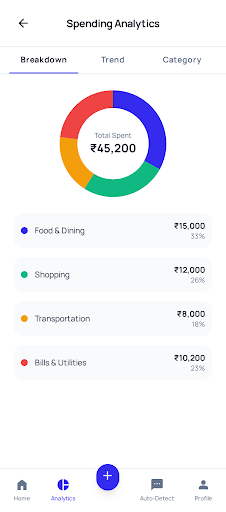
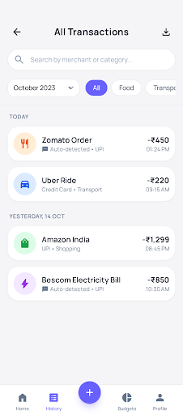
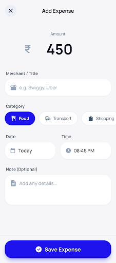

<div align="center">

# SpendSmart

[](https://github.com/Siddesh-bype/SpendSmart)

<p align="center">
  <strong>An air-gapped, zero-telemetry personal expense engine built with Flutter and Hive NoSQL for Android.</strong>
</p>

[](https://flutter.dev)
[](https://android.com)
[](https://pub.dev/packages/hive)
[](test/)
[](#-the-why-hardest-problem-solved)
[](LICENSE)

<br />

[Features](#-key-capabilities) •
[Architecture](#-architecture--data-pipeline) •
[Quickstart](#-3-step-quickstart) •
[Verification](#-automated-verification-suite) •
[Deep Technical Specs](#-deep-technical-specifications) •
[Release Build](#-production-android-release)

</div>

---

## ⚡ The "Why": Hardest Problem Solved

> **"Why build an air-gapped local tracker instead of relying on cloud aggregators or Postgres?"**
>
> Modern personal finance apps treat user privacy as an afterthought—mandating third-party bank logins, transmitting transaction ledgers to remote telemetry servers, and locking basic budgeting behind SaaS subscriptions. 
> 
> **SpendSmart solves the zero-cloud financial intelligence challenge**: delivering sub-millisecond query latency, dynamic custom-cycle budgeting, automated PDF/CSV statement ingestion, merchant anomaly detection, and peer group split math **strictly within the Android app sandbox**. No remote databases, no background network daemons, no tracking tokens—your financial life never leaves your physical silicon.

---

## 📊 Paradigm Shift: Cloud SaaS vs. SpendSmart

| Feature Dimension | Traditional Cloud Tracker | SpendSmart Local-First |
| :--- | :--- | :--- |
| **Data Residency** | Remote AWS / Cloud Database | **Android App Sandbox (`/data/user/0/...`)** |
| **Network Dependency** | Required for reads & writes | **100% Air-Gapped (Zero network permissions needed)** |
| **Read / Write Latency** | 200ms – 1,500ms (HTTP overhead) | **< 1ms (In-memory binary pointer + Hive)** |
| **Telemetry & Tracking** | Firebase, Mixpanel, Ads SDKs | **Zero Analytics, Zero Trackers, Zero PII leaks** |
| **Account Requirement** | Mandatory OAuth / Password | **Zero registration (Instant boot, instant use)** |
| **Statement Parsing** | Server-side OCR & remote uploads | **On-device text stream extraction & CSV normalizer** |
| **Export Freedom** | Paywalled or rate-limited | **1-Click Native PDF statement & CSV export** |

---

## 📸 Interface Showcase

SpendSmart combines high-density financial metrics with modern glassmorphism design tokens, full theme adaptivity (Dark/Light/AMOLED), and reduced-motion ergonomics.

<div align="center">

| Real-Time Dashboard & Spending Pulse | Trend Analytics & Categorical Allocation |
| :---: | :---: |
|  |  |
| *Live spending pulse gauge, remaining daily budget, and quick actions* | *Rolling period category breakdown, monthly delta bars, and velocity* |

| Custom Cycle Budget Management | Transaction Ledger & Quick Filters |
| :---: | :---: |
|  |  |
| *Custom start-day rolling windows (1st–28th) with category caps* | *High-density transaction ledger with multi-criteria search and filter* |

| Staged CSV/PDF Ingestion & Review | Instant Expense Capture Sheet |
| :---: | :---: |
|  |  |
| *Pre-commit transaction gate: review, resolve aliases, discard duplicates* | *Sub-second entry modal with smart category memory and split support* |

</div>

---

## 🚀 Key Capabilities

- 💸 **Deterministic Transaction Tracking**: Add, edit, soft-filter, and tag expenses, incomes, lendings, and recurring subscriptions.
- 🔄 **Custom Billing Cycle Engine**: Configure budget cycles to align with your real payday (1st through 28th of the month) rather than rigid calendar boundaries.
- 👥 **Group Splits & Debt Settlement**: Native pairwise and split-group ledger with automatic balance equalization algorithms.
- 📑 **Air-Gapped Statement Importers**:
  - **CSV Parser**: Normalizes arbitrary bank exports through alias resolution (`Date`, `Txn Date`, `Amount`, `Debit`, `Merchant`).
  - **PDF Statement Extractor**: Parses text-stream bank statements locally with explicit debit marker detection—no cloud OCR.
- 📈 **Spending Pulse & Anomaly Guard**: Calculates burn-rate projections across the active billing cycle and surfaces merchant anomalies using deterministic local statistical baselines.
- 📤 **Native Share Integration**: Compiles polished PDF reports and sanitized CSV exports directly into Android's native share sheet.

---

## 🏗 Architecture & Data Pipeline

The app follows strict **Separation of Concerns (SoC)**: zero framework logic in models, zero database logic in UI widgets, and write-verified transactional persistence.

<div align="center">
  
</div>

### Architectural Highlights

1. **Ingestion Layer**: Ingests raw inputs from the UI, text-based bank statement PDFs, or RFC-4180 CSV tables. All imports pass through a staged pre-commit screen (`PendingScreen`) before touching the database.
2. **State & Validation Engine**: Riverpod `Notifier` providers manage state transitions. Writes are guaranteed to be committed to disk before UI notifications are dispatched (`confirm write before notify`).
3. **Storage Engine**: Hive key-value binary boxes execute synchronous in-memory lookups with asynchronous lazy disk flushes inside the protected Android per-app sandbox.
4. **Export Engine**: Generates vector-perfect PDF statement files and CSV bundles in temporary app storage, triggering Android's native `ACTION_SEND` intents.

---

## ⚡ 3-Step Quickstart

Clone, install dependencies, and launch SpendSmart in under 60 seconds.

### 1. Prerequisites
- **Flutter SDK**: `>= 3.10.7` (Dart `3.x`)
- **Android SDK**: API level 36 (`targetSdkVersion 36`)
- **PowerShell / Terminal**

### 2. Setup & Verification
```powershell
# Clone the repository
git clone https://github.com/Siddesh-bype/SpendSmart.git
cd spendsmart

# Restore packages & compile platform plugins
C:\flutter\bin\flutter.bat pub get

# Run the 98-test verification suite
C:\flutter\bin\flutter.bat test
```

### 3. Run on Device / Emulator
```powershell
# Launch on connected Android device or running emulator
C:\flutter\bin\flutter.bat run
```

---

## 🧪 Automated Verification Suite

SpendSmart enforces high test rigor across state mutations, custom month offsets, statement parsing, and regression coverage.

<div align="center">
  
</div>

Run the full static analysis and unit/widget test suite:

```powershell
# Analyze codebase for lint rules and type safety
C:\flutter\bin\flutter.bat analyze

# Run complete test suite with coverage
C:\flutter\bin\flutter.bat test --reporter=expanded
```

---

## 🔍 Deep Technical Specifications

<details>
<summary><strong>📦 1. Hive Storage Model & Persistence Lifecycle</strong></summary>

<br />

SpendSmart uses **Hive**, a lightweight, blazing-fast key-value database written in pure Dart. Data is organized into strongly typed binary boxes registered via type adapters:

```dart
// Core Type Adapters
Hive.registerAdapter(ExpenseAdapter());       // typeId: 0
Hive.registerAdapter(CategoryAdapter());      // typeId: 1
Hive.registerAdapter(BudgetAdapter());        // typeId: 2
Hive.registerAdapter(IncomeAdapter());        // typeId: 3
Hive.registerAdapter(LendingAdapter());       // typeId: 4
Hive.registerAdapter(RecurringExpenseAdapter()); // typeId: 5
Hive.registerAdapter(SplitGroupAdapter());    // typeId: 6
Hive.registerAdapter(GroupExpenseAdapter());  // typeId: 7
```

### Transactional Write Guarantee
To eliminate UI-to-disk desynchronization, all Riverpod notifiers verify that storage commits have completed before emitting state changes:

```dart
Future<void> addExpense(Expense expense) async {
  // 1. Persist to Hive box with await
  await _storageService.saveExpense(expense);
  
  // 2. Query state from persistent box to ensure consistency
  state = _storageService.getAllExpenses();
}
```

### Corruption Recovery Policy
Automatic box clearing on open exceptions is strictly guarded. If a box encounters a format error, SpendSmart isolates the file rather than destructively erasing user financial history, giving the user manual export and recovery pathways.

</details>

<details>
<summary><strong>🗓️ 2. Dynamic Financial Period & Rolling Cycle Algorithm</strong></summary>

<br />

Most budget trackers fail when users get paid mid-month (e.g. the 15th or 25th) because standard date libraries anchor on calendar month boundaries (`1st` to `31st`). 

SpendSmart implements a dedicated `FinancialPeriod` calculator that determines exact billing cycle boundaries:

```dart
class FinancialPeriod {
  final DateTime startDate;
  final DateTime endDate;

  static FinancialPeriod current({required int startDay, DateTime? referenceDate}) {
    final now = referenceDate ?? DateTime.now();
    DateTime cycleStart;
    DateTime cycleEnd;

    if (now.day >= startDay) {
      cycleStart = DateTime(now.year, now.month, startDay);
      final nextMonth = DateTime(now.year, now.month + 1, 1);
      cycleEnd = DateTime(nextMonth.year, nextMonth.month, startDay)
          .subtract(const Duration(milliseconds: 1));
    } else {
      cycleStart = DateTime(now.year, now.month - 1, startDay);
      cycleEnd = DateTime(now.year, now.month, startDay)
          .subtract(const Duration(milliseconds: 1));
    }

    return FinancialPeriod(startDate: cycleStart, endDate: cycleEnd);
  }
}
```

This guarantees that budget alerts, daily allowances, and category progress bars reflect the actual active earnings window.

</details>

<details>
<summary><strong>📥 3. Air-Gapped CSV & PDF Statement Ingestion Engine</strong></summary>

<br />

### CSV Alias Normalizer
Bank CSV exports vary wildly across institutions. SpendSmart dynamically maps diverse column headers into canonical models without manual user column mapping:

```dart
// CsvImportService header aliases
static const List<String> dateAliases = ['date', 'txn date', 'transaction date', 'posting date', 'value date'];
static const List<String> titleAliases = ['description', 'title', 'narration', 'details', 'merchant', 'particulars'];
static const List<String> amountAliases = ['amount', 'debit', 'txn amount', 'withdrawal', 'dr'];
```

- **Deduplication Engine**: Calculates SHA-256 fingerprint hashes combining `(date, title, amount)` to flag previously imported rows.
- **Pre-Commit Staging**: Parses rows into a temporary staged state, allowing users to toggle, categorize, or discard items before committing to disk.

### PDF Stream Parser
Extracts text streams from digital bank statements, identifies structured tabular layouts using spatial coordinates, matches date formats (`dd/MM/yyyy`, `yyyy-MM-dd`), and extracts debits via marker patterns (`DR`, `Dr.`, negative amounts). Scanned image statements are intentionally rejected to maintain the zero-cloud/zero-heavy-dependency model.

</details>

<details>
<summary><strong>🔒 4. Android Sandbox Threat Model & Privacy Boundary</strong></summary>

<br />

### Storage Security Architecture
- **Sandboxed File System**: Hive database files reside in `/data/user/0/com.example.spendsmart/app_flutter/`. Android enforces Linux UID-based isolation; no other non-root app can read or modify these files.
- **Zero Remote Endpoints**: The application binary contains zero HTTP networking libraries, no remote API URLs, and no sync daemon services.
- **Export Sanitization**: Temporary files created for PDF or CSV exports are placed in Android's cache directory and marked with `FLAG_GRANT_READ_URI_PERMISSION` via FileProvider, expiring after the share intent closes.

```mermaid
graph TD
    User([User Device]) --> UI[Flutter Material UI]
    UI --> Riverpod[Riverpod State Layer]
    Riverpod --> Storage[StorageService]
    Storage --> Hive[(Hive Binary Store)]
    
    subgraph Android App Sandbox [Protected UID Sandbox: /data/user/0/...]
        Storage
        Hive
    end
    
    subgraph Network Boundary [Air-Gapped Isolation]
        Internet((External Cloud / Internet))
        Hive -.x|NO NETWORK CALLS| Internet
    end
```

</details>

<details>
<summary><strong>👥 5. Group Split Math & Settle-Up Algorithm</strong></summary>

<br />

SpendSmart supports multi-person split groups with zero backend connectivity. When expenses are split unevenly or evenly across group participants, the settle-up engine calculates pairwise debt resolution:

1. **Net Balance Calculation**: For each member $i$, computes:
   $$\text{Net}_i = \sum \text{Paid}_i - \sum \text{Owed}_i$$
2. **Minimization Strategy**: Matches highest debtors with highest creditors to minimize total transaction count needed to settle balances to zero.
3. **Local Receipt Tracking**: Settle-up operations generate balancing transaction records directly in the local database.

</details>

---

## 📦 Production Android Release

SpendSmart is compiled with **R8 code shrinking, resource stripping, and ABI-split APK generation** to minimize disk footprint and memory overhead.

### 1. Configure Keystore
Create `android/key.properties` with your private release signing keys:

```properties
storePassword=YOUR_KEYSTORE_PASSWORD
keyPassword=YOUR_KEY_PASSWORD
keyAlias=YOUR_KEY_ALIAS
storeFile=C:\\path\\to\\your\\upload-keystore.jks
```

### 2. Build Optimized Release APKs
```powershell
C:\flutter\bin\flutter.bat build apk `
  --release `
  --split-per-abi `
  --obfuscate `
  --split-debug-info=build\symbols
```

Generated per-architecture APKs (`armeabi-v7a`, `arm64-v8a`, `x86_64`) will be output to:
`build\app\outputs\flutter-apk\`

---

## 🛠 Tech Stack

- **Framework**: [Flutter](https://flutter.dev) (Dart 3)
- **State Management**: [Flutter Riverpod](https://pub.dev/packages/flutter_riverpod)
- **Local Storage**: [Hive](https://pub.dev/packages/hive) & [Hive Flutter](https://pub.dev/packages/hive_flutter)
- **Charts & Metrics**: [FL Chart](https://pub.dev/packages/fl_chart)
- **Reporting**: [pdf](https://pub.dev/packages/pdf) & [printing](https://pub.dev/packages/printing)
- **Parsing**: [csv](https://pub.dev/packages/csv) & [syncfusion_flutter_pdf](https://pub.dev/packages/syncfusion_flutter_pdf)
- **Animations**: Flutter Implicit Animations + Custom Glassmorphism Canvas

---

## 📄 License

This project is licensed under the **MIT License** - see the [LICENSE](LICENSE) file for details.
