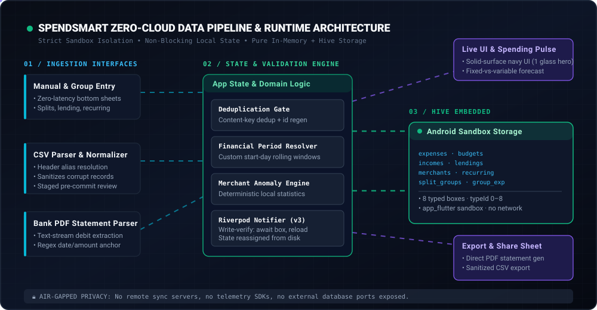

<div align="center">

# SpendSmart

[](https://github.com/Siddesh-bype/SpendSmart)

<p align="center">
  <strong>An air-gapped, zero-telemetry personal expense engine built with Flutter and Hive NoSQL for Android.</strong><br />
  No accounts. No cloud. No trackers. Your ledger never leaves your silicon.
</p>

[](https://flutter.dev)
[](https://android.com)
[](https://pub.dev/packages/hive)
[](test/)
[](#-the-why-hardest-problem-solved)

<br />

[Why](#-the-why-hardest-problem-solved) •
[Cloud vs Local](#-paradigm-shift-cloud-saas-vs-spendsmart) •
[Capabilities](#-key-capabilities) •
[Architecture](#-architecture--data-pipeline) •
[Quickstart](#-3-step-quickstart) •
[Verification](#-automated-verification-suite) •
[Deep Tech Specs](#-deep-technical-specifications) •
[Release Build](#-production-android-release)

</div>

---

## ⚡ The "Why": Hardest Problem Solved

> **"Why build an air-gapped local tracker instead of relying on cloud aggregators or a hosted database?"**
>
> Modern personal-finance apps treat privacy as an afterthought — mandatory bank logins, ledgers shipped to remote telemetry servers, basic budgeting locked behind SaaS subscriptions.
>
> **SpendSmart takes the zero-cloud financial-intelligence challenge**: sub-HTTP-latency local reads, custom payday-aligned budget cycles, on-device PDF/CSV statement ingestion, a deterministic merchant anomaly guard, fixed-vs-variable burn-rate forecasting, and group split math — **entirely inside the Android app sandbox**. The dependency list contains zero `http` / networking / Firebase / analytics packages. Your financial life never leaves your physical device.

---

## 📊 Paradigm Shift: Cloud SaaS vs. SpendSmart

| Feature Dimension | Traditional Cloud Tracker | SpendSmart Local-First |
| :--- | :--- | :--- |
| **Data Residency** | Remote cloud database | **Android app sandbox (`…/app_flutter/`)** |
| **Network Dependency** | Required for reads & writes | **100% air-gapped — zero network dependencies** |
| **Read / Write Path** | HTTP round-trip per query | **Local Hive binary I/O, no HTTP round-trip** |
| **Telemetry & Tracking** | Firebase, Mixpanel, ads SDKs | **Zero analytics, zero trackers** |
| **Account Requirement** | Mandatory OAuth / password | **Zero registration — instant boot, instant use** |
| **Statement Parsing** | Server-side OCR / remote upload | **On-device text-stream extraction + CSV normalizer** |
| **Forecasting** | Server models on your data | **On-device fixed-obligation detection + burn-rate pace** |
| **Export Freedom** | Paywalled or rate-limited | **Native-share PDF statements + sanitized CSV** |
| **Erase Guarantee** | "Delete" is a server-side promise | **Confirm-gated local wipe (`clearAllData`) you can audit** |

---

## 🎨 Design Language

SpendSmart ships a three-layer token system (raw palette → per-brightness theme → component focus/scrim), retokened screen by screen:

- **Dark:** bg `#010736` · surface `#0D1C42` · ink `#E9EDF5` (16.5:1) · muted `#9AA6C2` (7.9:1) · CTA = ink fill + `#010736` text.
- **Light:** bg `#F9F7F7` · surface `#FFFFFF` · ink `#112D4E` (13:1) · muted `#5C6B80` (5.1:1) · primary `#3F72AF` (CTA white text 4.96:1).
- **Rules:** minimal solid-surface cards with 1px hairline borders (16–18dp), exactly **one** glass hero (the pulse card), CTA pills ≥ 48dp, touch targets ≥ 44dp, inline errors, tabular numerals for all money, reduced-motion snapping for entrance tweens, no emoji-as-icons.

> **Note on screenshots:** `assets/screenshots/*.png` predate the redesign (old nav, removed SMS auto-detect copy) and are deliberately **not referenced** here until refreshed on a real device. Nothing below depends on them.

---

## 🚀 Key Capabilities

- 💸 **Deterministic transaction tracking** — expenses, incomes, lendings, and recurring subscriptions with edit, multi-criteria search, and quick filters.
- 🗓️ **Custom billing-cycle engine** — budget cycles anchored to your real payday (start day 1–28), not rigid calendar months, via a dedicated `FinancialPeriod` calculator.
- 📈 **Spending pulse with fixed-vs-variable forecast** — fixed obligations (rent, EMIs, subscriptions) detected from consecutive stable history project 1:1, while only variable spend paces by burn rate. Cold-start months are explicitly flagged as early estimates.
- 🛡️ **On-device anomaly guard** — merchant spikes flagged at 1.5× (critical at 2×) against local baselines; fixed bills paid in full are excluded so they never false-positive.
- 🏷️ **Smart capture & merchant memory** — autocomplete with a removable category pill and an explicit "use suggested instead?" accept row that never auto-overrides your pick.
- 📑 **Air-gapped statement importers** — CSV normalizer (header-alias resolution, 5 MB guard, isolate decode, strict dates, formula-injection-safe round-trip) and PDF text-stream extractor (10 MB cap, debit-marker regexes; scanned-image statements intentionally rejected to stay zero-cloud). Every import lands in a staged pre-commit screen first.
- 👥 **Group splits with per-group identity** — split groups with tappable "this is me" chips (ME badge), settle-up sheets, and legacy-safe identity storage.
- 📤 **Native share integration** — PDF reports, lending PDFs, and sanitized CSV exports via Android's share sheet (cache + `FLAG_GRANT_READ_URI_PERMISSION`).
- 🧹 **Confirm-gated erase-all** — full data reset lives in the Settings Danger Zone behind an explicit confirmation; corruption quarantines boxes instead of deleting them.

---

## 🏗 Architecture & Data Pipeline

Strict **separation of concerns**: zero framework logic in models, zero database logic in widgets, Riverpod v3 state with write-verified persistence.

<div align="center">
  
</div>

### Architectural Highlights

1. **Ingestion layer** — manual entry sheets, RFC-4180 CSV tables, and text-based bank-statement PDFs. All imports pass through a staged pre-commit screen before touching the database.
2. **State & validation engine** — Riverpod `Notifier` providers. Writes are awaited to disk and state is reloaded from the box before the UI is notified (*confirm write before notify*).
3. **Storage engine** — eight typed Hive binary boxes inside the per-app sandbox (`…/app_flutter/`), Linux UID-isolated by Android.
4. **Export engine** — vector PDF statements and CSV bundles staged in app cache, handed to Android `ACTION_SEND` intents.

---

## ⚡ 3-Step Quickstart

Clone, install, and launch in under 60 seconds. Flutter lives at `C:\flutter\bin\flutter.bat` (not on `PATH`).

### 1. Prerequisites

- **Flutter SDK** `>= 3.10.7` (Dart `^3.10.7`)
- **Android SDK**, app targets API 36 (`compileSdk 36`, `targetSdk 36`, `com.siddesh.spendsmart`)
- **PowerShell**

### 2. Setup & Verify

```powershell
# Clone the repository
git clone https://github.com/Siddesh-bype/SpendSmart.git
cd spendsmart

# Restore packages
C:\flutter\bin\flutter.bat pub get

# Static analysis (clean) + full 122-test suite (green)
C:\flutter\bin\flutter.bat analyze
C:\flutter\bin\flutter.bat test
```

### 3. Run on Device / Emulator

```powershell
# Launch on a connected Android device or running emulator
C:\flutter\bin\flutter.bat run
```

---

## 🧪 Automated Verification Suite

`flutter analyze` is clean and **all 122 tests pass** across 13 files — period math, classifier precedence, anomaly baselines with fixed-obligation exclusion, pulse projection with cold-start, CSV/import edge cases, wipe behavior, provider write-verify semantics, and compact-phone visibility in both themes.

<div align="center">
  
</div>

```powershell
# Lint + type safety
C:\flutter\bin\flutter.bat analyze

# Full suite, expanded reporter
C:\flutter\bin\flutter.bat test --reporter=expanded
```

| Area | Files |
| :--- | :--- |
| Period & date math | `financial_period_test.dart`, `date_extension_test.dart` |
| Classification & anomaly | `category_classifier_test.dart`, `merchant_anomaly_service_test.dart` |
| Forecast & pulse | `financial_calculation_engine_test.dart`, `spending_pulse_projection_test.dart`, `analytics_daily_category_test.dart` |
| Ingestion | `csv_import_service_test.dart`, `pdf_import_service_test.dart` |
| State, wipe, UI | `provider_behavior_test.dart`, `storage_service_wipe_test.dart`, `screen_visibility_test.dart`, `validation_test.dart` |

---

## 🔍 Deep Technical Specifications

<details>
<summary><strong>📦 1. Hive Storage Model, Lifecycle & Null-Tolerant Adapters</strong></summary>

<br />

Eight typed binary boxes — `expenses`, `merchants`, `budgets`, `lendings`, `incomes`, `recurring_expenses`, `split_groups`, `group_expenses` — registered via `typeId` 0–8:

| `typeId` | Model | Adapter |
| :--- | :--- | :--- |
| 0 | `Category` | codegen |
| 1 | `Expense` | codegen |
| 2 | `MerchantMemory` | codegen |
| 3 | `Budget` | codegen |
| 4 | `Income` | **hand-written, null-tolerant** |
| 5 | `Lending` | codegen |
| 6 | `RecurringExpense` | **hand-written, null-tolerant** |
| 7 | `SplitGroup` | **hand-written, null-tolerant** |
| 8 | `GroupExpense` | **hand-written, null-tolerant** |

Hand-written adapters read defensively field-by-field so a missing or null trailing field degrades to a default instead of throwing. The flagship example is `SplitGroup.myParticipantId` (per-group "this is me" identity): an **optional trailing Hive field 4** — `null` preserves legacy first-participant behavior, and both read directions are safe.

**Corruption policy:** a box that fails to open is **quarantined, never deleted** — user financial history is isolated for manual export/recovery rather than destructively erased.

</details>

<details>
<summary><strong>🗓️ 2. Dynamic Financial Period & Rolling-Cycle Algorithm</strong></summary>

<br />

Calendar-month budgeting breaks for anyone paid mid-month. `FinancialPeriod` computes **half-open billing cycles** for any start day clamped to **1–28**:

- Reference date on/after `startDay` → cycle runs `startDay` of this month → just before `startDay` of next month; otherwise it spans the previous month boundary.
- `shifted(n)` walks whole cycles for trailing-history windows; `contains(date)` gates every aggregation (forecast, anomaly, analytics).

Budget alerts, daily allowances, and category progress bars therefore reflect the real earnings window, and the detector tolerates month-length edge cases by construction.

</details>

<details>
<summary><strong>📥 3. Air-Gapped CSV & PDF Statement Ingestion</strong></summary>

<br />

**CSV normalizer** (`CsvImportService`):
- 5 MB size guard, isolate-based decode, dynamic header-alias mapping (`date` / `txn date` / `posting date`, `description` / `narration` / `merchant`, `amount` / `debit` / `withdrawal` …) — no manual column mapping.
- Strict date parsing, corrupt-row skipping with counts, and a formula-injection-safe export round-trip.
- One shared `CategoryClassifier.exactCategory` path, with merchant-memory lookup forwarded — CSV and manual entry can never disagree on categorization.

**PDF extractor** (`maxPdfBytes` = 10 MB, isolate decode): parses digital text streams, anchors on date formats and debit markers (`DR`, `Dr.`, negatives), skips headers/credits. **Scanned-image statements are rejected by design** — cloud OCR would break the air-gap.

**Commit safety:** parsed rows land in a staged pre-commit screen; the provider's `importExpenses` regenerates ids on collision (a re-exported file can never overwrite unrelated rows) and drops content-key (`_expenseKey`) duplicates, so re-importing a file is a no-op.

</details>

<details>
<summary><strong>📈 4. Fixed-Obligation Forecast Math</strong></summary>

<br />

`FixedObligationService.detect()` (pure Dart — no Hive, no Riverpod, no widgets):

1. Totals per normalized merchant (via `CategoryClassifier.normalizeMerchant`, which strips rails/handles/ref-numbers/corp suffixes) across the last `historyMonths` (default **3**) completed `FinancialPeriod`s. Uncategorized, non-finite, and non-positive amounts are excluded.
2. The **trailing run** — consecutive non-zero months anchored at the newest history period — must span **≥ 2** months; a gap month breaks consecutiveness, and an old stable streak that has since changed does not qualify.
3. The run shrinks from the oldest end until relative spread `(max − min) / mean` drops below `varianceTolerance` (default **0.15**) — a bill that changed and re-stabilized commits at the new level. Expected amount = run mean, rounded to paise.

**Forecast** (`projectMonthEndDetailed`): fixed obligations project **1:1**, only variable spend paces by burn rate. `isEarlyEstimate` is true with fewer than 2 history months and is rendered in the UI; baselines divide by **months-with-data**, never by wall-clock months.

</details>

<details>
<summary><strong>🛡️ 5. On-Device Anomaly Guard Math</strong></summary>

<br />

Per-merchant spike detection over trailing history, all local:

- Flag at **1.5×** baseline, critical at **2×**, with a minimum-impact floor so paise-level noise never alerts.
- Guard relaxed to **≥ 2-of-3 months** of history so real users get protection early.
- `FixedObligationService.isWithinCommitment()` excludes a fixed bill paid in full: within-tolerance of the expected amount (relative difference against their mean) never flags, while a genuine overage still does.

</details>

<details>
<summary><strong>🔔 6. Notification Stable-Id Migration</strong></summary>

<br />

`notificationProvider` persists to `SharedPreferences` (`app_notifications_v1`) with a **stable id, not the enum index**: `budgetWarning → 0`, `budgetExceeded → 1`, `tip → 3`. Id **2** belonged to the removed `spendingMilestone` variant and **stays vacant forever** — old payloads decode to `tip` instead of crashing or misrouting. Never reuse 2, never reorder.

</details>

<details>
<summary><strong>🔒 7. Write-Verify Providers, Sandbox & Erase Guarantees</strong></summary>

<br />

- **Write-verify pattern:** every mutating notifier awaits the box write, reloads from disk, then assigns state — the UI can never show data that isn't persisted. The sole exception is `notificationProvider` (mutate-then-persist; notifications are non-critical).
- **Sandbox boundary:** Hive files live under the app's `app_flutter` dir (`/data/user/0/com.siddesh.spendsmart/…`), UID-isolated by Android. The binary declares no sync endpoints; exports are cache-staged with `FLAG_GRANT_READ_URI_PERMISSION` and die with the share intent.
- **Erase guarantee:** `clearAllData()` is the single wipe path, reachable only from the Settings **Danger Zone** behind an explicit confirmation gate — and `storage_service_wipe_test` pins its semantics.

</details>

---

## 📦 Production Android Release

R8 code shrinking + resource shrinking are enforced in `android/app/build.gradle.kts` (`isMinifyEnabled`, `isShrinkResources`).

### 1. Configure Keystore

Create `android/key.properties` (never commit it):

```properties
storePassword=YOUR_KEYSTORE_PASSWORD
keyPassword=YOUR_KEY_PASSWORD
keyAlias=YOUR_KEY_ALIAS
storeFile=C:\\path\\to\\your\\upload-keystore.jks
```

### 2. Build Optimized Release APKs

```powershell
C:\flutter\bin\flutter.bat build apk `
  --release `
  --split-per-abi `
  --obfuscate `
  --split-debug-info=build\symbols
```

Per-architecture APKs (`armeabi-v7a`, `arm64-v8a`, `x86_64`) land in `build\app\outputs\flutter-apk\`.

---

## 🛠 Tech Stack

App version **2.1.7+217** (Dart SDK `^3.10.7`).

| Layer | Package | Version |
| :--- | :--- | :--- |
| State | `flutter_riverpod` | `^3.2.1` |
| Storage | `hive` / `hive_flutter` | `^2.2.3` / `^1.1.0` |
| Charts | `fl_chart` | `^1.1.1` |
| Reports (PDF in/out) | `syncfusion_flutter_pdf` | `^32.2.6` |
| Statement parsing (CSV) | `csv` | `^7.2.0` |
| Sharing & files | `share_plus`, `open_filex`, `file_picker`, `path_provider` | `^10.0.0`, `^4.5.1`, `^8.0.7`, `^2.1.5` |
| Prefs & identity | `shared_preferences`, `uuid`, `intl`, `crypto` | `^2.5.4`, `^4.5.3`, `^0.20.2`, `^3.0.7` |
| Gestures | `flutter_slidable` | `^4.0.3` |
| Device info | `package_info_plus` | `^9.0.0` |
| Lints | `flutter_lints` | `^6.0.0` |

> Exact resolved versions live in `pubspec.lock`. No `http`, networking, Firebase, or analytics packages anywhere in the tree.

---

## 📄 License

Intended license is **MIT**, but no `LICENSE` file is committed yet — it must be added before public distribution. Until then, all rights remain with the author.

---

<div align="center">
  <sub>Air-gapped by design · Verified by 122 tests · Built with Flutter</sub>
</div>
